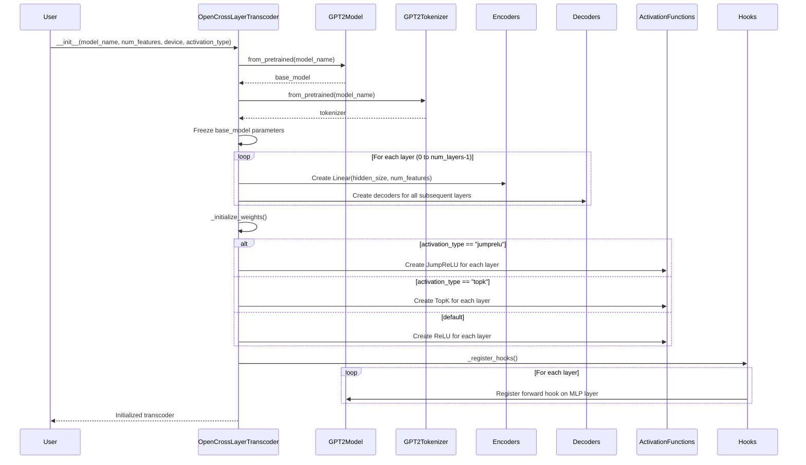
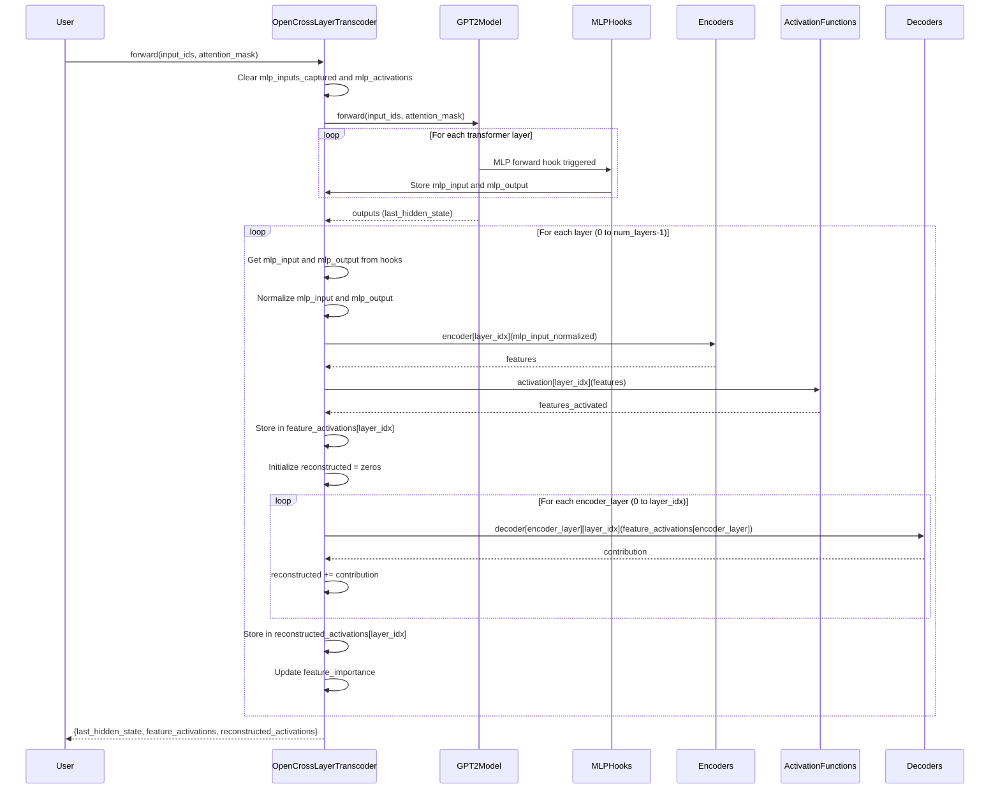
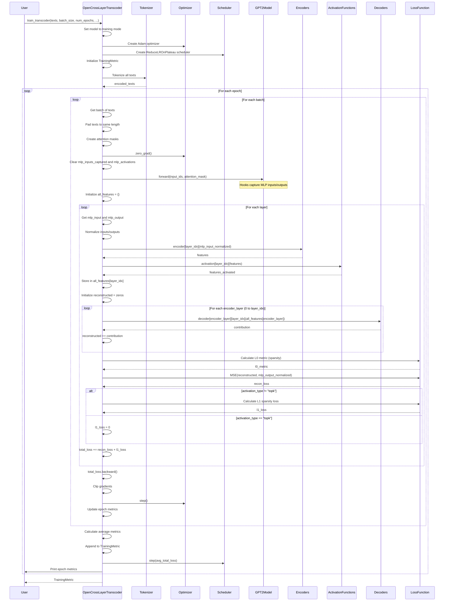
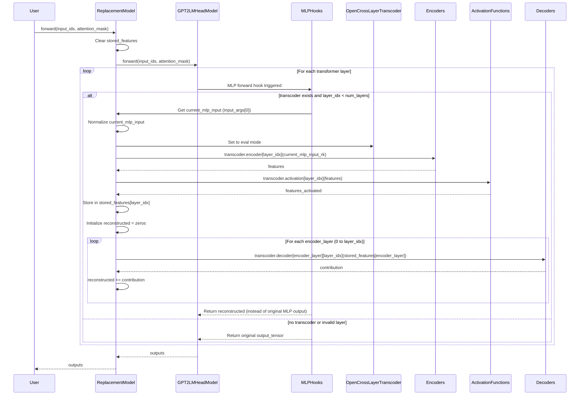
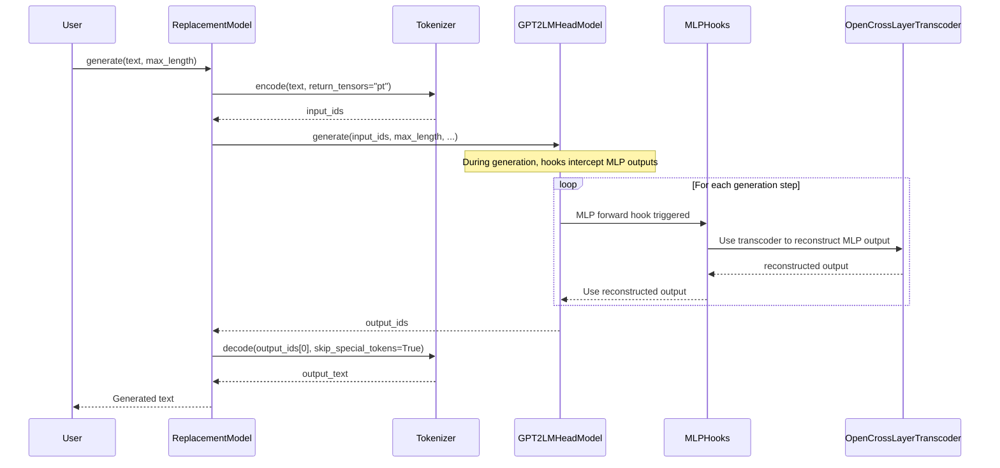
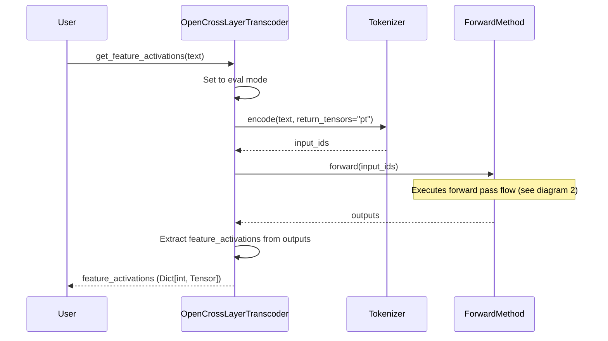

# Sequence Diagrams for Open Cross-Layer Transcoder

This document contains sequence diagrams illustrating the flow of operations in the Open Cross-Layer Transcoder implementation.

## 1. Initialization Flow

## 2. Forward Pass (Inference) Flow

## 3. Training Flow

## 4. ReplacementModel Forward Pass Flow

## 5. Text Generation with ReplacementModel

## 6. Feature Activation Extraction Flow

## Key Components

### Hooks System
- **Purpose**: Capture MLP inputs and outputs during forward pass
- **Registration**: Done in `_register_hooks()` during initialization
- **Storage**: MLP inputs/outputs stored in `mlp_inputs_captured` and `mlp_activations` dictionaries

### Cross-Layer Architecture
- **Encoders**: Map MLP inputs to interpretable features (one per layer)
- **Decoders**: Map features back to MLP output space (one per encoder-decoder layer pair)
- **Activation Functions**: Apply sparsity (JumpReLU, TopK, or ReLU)

### Training Process
- **Loss Components**:
  - Reconstruction Loss: MSE between reconstructed and actual MLP outputs
  - Sparsity Loss: L1 regularization on features (for non-TopK activations)
- **Optimization**: Adam optimizer with learning rate scheduling

### Replacement Model
- **Purpose**: Replace MLP outputs with transcoder reconstructions during inference
- **Mechanism**: Uses forward hooks to intercept and replace MLP outputs in real-time

